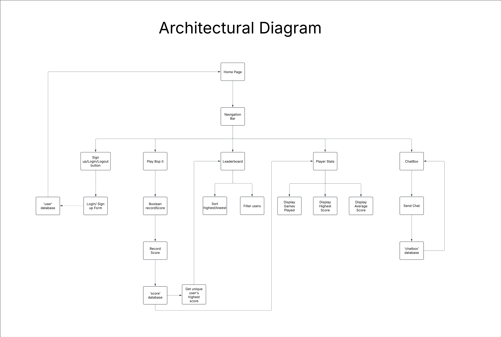
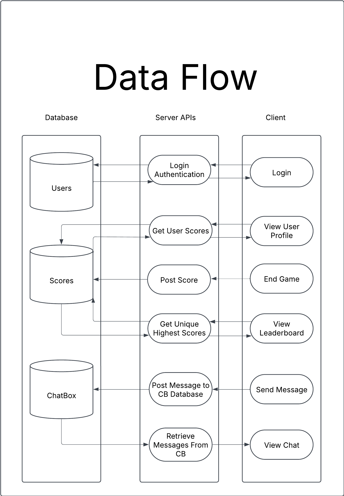

# Bop It! Project Proposal
### By: Tai Nguyen, Jessica Wang, Owen Wong
Check it out! [https://bop-it-final-project.onrender.com/](https://taiiwininfo441.me/)

# Project Description
## 0. Context/Setting the stage
Back in 1996, an original and classic game Bop It! was released to the public and played
on millions of handheld electronic devices. As many of us may know, it quickly gained traction
and became a core memory for us. Its unique functionality of testing your reflexes to the sound
of a phrase (“Bop it!”, “Twist it!”, “Pull it!) combined with increasing difficulty made it a staple
handheld game. However, despite its popularity, there is no widely available web-based version
that captures the same fast-paced, reaction-driven experience. Our project aims to change that by
bringing Bop It! to the internet, making it more accessible than ever before.

## 1. Who is your target audience? Who do you envision using your application?
Our application is designed for a wide range of users regardless of age or background.
However at its core, it’s geared a bit more towards casual gamers and nostalgic players who
enjoyed the original Bop It! but now seek a modern, easily accessible version. On top of this, we
envision competitive gamers can engage with the game through an online leaderboard, which
fosters a sense of friendly competition. This is coupled with users being able to look at their own
analytics as well(# of games played, highest score, etc) to try and not only see how far. If users
are looking for a quick reflex-based challenge, a casual way to pass time, and interact with users
through features like chat boxes and leaderboards, our platform is the perfect place.

## 2. Why does your audience want to use your application?
There are many reasons why our audience would want to utilize our application. First of
all, our adaptation of Bop It! allows users to access it through the internet, removing the
necessity of physical hardware. Our implementation also facilitates a community surrounding the
game through user authentication, global leaderboard, and global chatbox, which encourages
users to compete for high scores and challenge each other. As a final point, Bop It! appeals to a
broader audience and their nostalgia or love for reaction-based games.

## 3. Why do you as developers want to build this application?
As developers, we are excited to build this application because it presents a unique
technical challenge while also being a fun and engaging project. Developing a real-time
reaction-based game in a web environment requires careful consideration of performance, user
input handling, and timing mechanics. Additionally, integrating authentication and leaderboard
functionality will allow us to apply our knowledge of user sessions, databases, and interactive UI
design. This project is an opportunity for us to create something enjoyable. We want this game to
be one that users can easily access and play, whether it's for amusement or for competitive
engagement. By combining this nostalgia with web technologies, we hope this game serves as a
new take on a classic game that still is just as fun.

# Technical Description

## Architectural Diagram

## Data Flow

## Summary Tables for User Stories
| Priority | User | Description | Technical Implementation |
|----------|------|-------------|--------------------------|
| P0 | As a user | I want to be able to create or login/logout of an account. | When logging in, use Azure Authentication (Microsoft) to authenticate users. |
| P0 | As a user | I want to be able to play Bop It! | Create three buttons labeled “Bop It,” “Twist It,” and “Pull It.” Randomly display one of these commands. If the user clicks the correct button in time, increase their score by one. As the score increases, reduce the time allowed between commands every five points. This will all take place in the frontend, and the score will be tracked with a state variable. |
| P1 | As a user | I want to record the scores that I achieve. | Post score to MongoDB after the game is over. |
| P1 | As a user | I want to view my analytics through the games I've played in Bop It! on a metrics page. | Pull user’s scores from MongoDB and calculate metrics to be displayed. |
| P1 | As a user | I want to be able to compare my top score to other users through a leaderboard, from best to worst score. | Pull top scores from MongoDB, use query to filter greatest to least score. |
| P2 | As a user | I want to be able to filter top scores for certain users. | Implement filtering options in the leaderboard. |
| P2 | As a user | I want to be able to chat with other users online. | Provide ChatBox page that can only be accessed if a user is authenticated. Messages are stored in ChatBox collection in MongoDB. |
| P2 | As a user | I want to be able to delete my chat/comment if I no longer want it posted. | Provide a delete comment functionality (trash can icon) in ChatBox. |

## API EndPoints
### Auth:

GET /users/myIdenitity →  Retrieves the current user’s identity and login status

### Gameplay / Score:

POST /scores/game → Saves a user’s game score to the database.

GET /scores/leaderboard → Retrieves the top 10 highest scores for the leaderboard.

GET /scores/analytics → Retrieves analytics for a specific user (e.g., mean score, highest score, number of games played).

### Chat:

POST /chats/messages → Allow authenticated users to send messages to global chat

GET /chats/messages → Retrieve all stored chat messages to display

## Database Schemas
- ChatBox
    * username: String
    * message: String
    * timestamp: Date
- Scores
    * username: String
    * score: Number
    * score_date: Date
